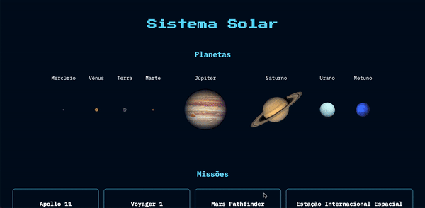

## Solar System 🪐:

## About:

Small project developed at the beginning of the <b>Front-End module</b> at Trybe.

The goal was to create a list of planets and some space missions. No interaction was needed, for the aim was simply to test the fundamentals of ReactJS. However, the current state of the application at least points users to a wikipedia article of every planet.

It was made using <b>ReactJS</b> and some <b>CSS</b>.

You can <a href="https://luacomacento.github.io/solar-system/" target="_blank">click here</a> to check the current state of the application.

## Tools:
<ul>
  <li>ReactJS</li>
  <li>CSS3</li>
</ul>

## In works:
As of now, I am no longer working on this project.
